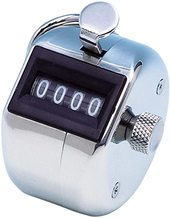

# Tally counter

Es un contador manual simple que aumenta la cuenta de uno en uno, iniciando en cero.

Soporta el modo noche/oscuro.

## Fabricación

Está hecho con _vanilla_ JavaScript, HTML y CSS.
